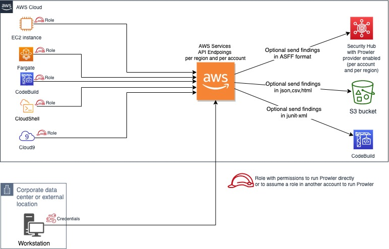

[](https://badge.fury.io/js/cdk-prowler)
[](https://badge.fury.io/py/cdk-prowler)
[](https://www.nuget.org/packages/com.github.mmuller88.cdkProwler/)


Author = <https://martinmueller.dev>

# cdk-prowler

An AWS CDK custom construct for deploying Prowler to your AWS Account. The following description about Prowler is taken from https://github.com/prowler-cloud/prowler

Prowler is a security tool to perform AWS security best practices assessments, audits, incident response, continuous monitoring, hardening and forensics readiness. It contains all CIS controls listed here https://d0.awsstatic.com/whitepapers/compliance/AWS_CIS_Foundations_Benchmark.pdf and more than 100 additional checks that help on GDPR, HIPAA …

It generates security html results which are stored in an s3 bucket:


And in your Codebuild Report group:


The current Prowler version is [2.7.0](https://blyx.com/2022/01/24/prowler-2-7-0-brave/)

# AWS AMI

If you just want to make the Prowler security checks in your account try my [Prowler AWS Marketplace AMI](https://aws.amazon.com/marketplace/pp/prodview-jlwcdlc3weta6). With just $1 Prowler will do over 180 security checks across a huge amount of AWS services in all your regions. Don't forget the terminate the Ec2 instance when the Prowler stack got created for not paying more than that $1 :).

With buying the AMI you support my on my passion for creating open source products like this cdk-prowler construct. Furthermore you enable me to work on future features like mentioned in the **Planned Features** section. Thank you so much :) !

# Example
```ts
import { ProwlerAudit } from 'cdk-prowler';
...
    const app = new App();

    const stack = new Stack(app, 'ProwlerAudit-stack');

    new ProwlerAudit(stack, 'ProwlerAudit');
```

# Architect diagram


# cdk-prowler Properties

cdk-prowler supports some properties to tweak your stack. Like for running a Cloudwatch schedule to regualary run the Prowler scan with a defined cron expression.

# API Reference <a name="API Reference"></a>

## Constructs <a name="Constructs"></a>

### ProwlerAudit <a name="cdk-prowler.ProwlerAudit"></a>

Creates a CodeBuild project to audit an AWS account with Prowler and stores the html report in a S3 bucket.

This will run onece at the beginning and on a schedule afterwards. Partial contribution from https://github.com/stevecjones

#### Initializers <a name="cdk-prowler.ProwlerAudit.Initializer"></a>

```typescript
import { ProwlerAudit } from 'cdk-prowler'

new ProwlerAudit(parent: Stack, id: string, props?: ProwlerAuditProps)
```

##### `parent`<sup>Required</sup> <a name="cdk-prowler.ProwlerAudit.parameter.parent"></a>

- *Type:* [`@aws-cdk/core.Stack`](#@aws-cdk/core.Stack)

---

##### `id`<sup>Required</sup> <a name="cdk-prowler.ProwlerAudit.parameter.id"></a>

- *Type:* `string`

---

##### `props`<sup>Optional</sup> <a name="cdk-prowler.ProwlerAudit.parameter.props"></a>

- *Type:* [`cdk-prowler.ProwlerAuditProps`](#cdk-prowler.ProwlerAuditProps)

---


#### Properties <a name="Properties"></a>

##### `codebuildProject`<sup>Required</sup> <a name="cdk-prowler.ProwlerAudit.property.codebuildProject"></a>

```typescript
public readonly codebuildProject: Project;
```

- *Type:* [`@aws-cdk/aws-codebuild.Project`](#@aws-cdk/aws-codebuild.Project)

---

##### `enableScheduler`<sup>Required</sup> <a name="cdk-prowler.ProwlerAudit.property.enableScheduler"></a>

```typescript
public readonly enableScheduler: boolean;
```

- *Type:* `boolean`

---

##### `logsRetentionInDays`<sup>Required</sup> <a name="cdk-prowler.ProwlerAudit.property.logsRetentionInDays"></a>

```typescript
public readonly logsRetentionInDays: RetentionDays;
```

- *Type:* [`@aws-cdk/aws-logs.RetentionDays`](#@aws-cdk/aws-logs.RetentionDays)

---

##### `prowlerOptions`<sup>Required</sup> <a name="cdk-prowler.ProwlerAudit.property.prowlerOptions"></a>

```typescript
public readonly prowlerOptions: string;
```

- *Type:* `string`

---

##### `prowlerScheduler`<sup>Required</sup> <a name="cdk-prowler.ProwlerAudit.property.prowlerScheduler"></a>

```typescript
public readonly prowlerScheduler: string;
```

- *Type:* `string`

---

##### `prowlerVersion`<sup>Required</sup> <a name="cdk-prowler.ProwlerAudit.property.prowlerVersion"></a>

```typescript
public readonly prowlerVersion: string;
```

- *Type:* `string`

---

##### `serviceName`<sup>Required</sup> <a name="cdk-prowler.ProwlerAudit.property.serviceName"></a>

```typescript
public readonly serviceName: string;
```

- *Type:* `string`

---


## Structs <a name="Structs"></a>

### ProwlerAuditProps <a name="cdk-prowler.ProwlerAuditProps"></a>

#### Initializer <a name="[object Object].Initializer"></a>

```typescript
import { ProwlerAuditProps } from 'cdk-prowler'

const prowlerAuditProps: ProwlerAuditProps = { ... }
```

##### `additionalS3CopyArgs`<sup>Optional</sup> <a name="cdk-prowler.ProwlerAuditProps.property.additionalS3CopyArgs"></a>

```typescript
public readonly additionalS3CopyArgs: string;
```

- *Type:* `string`

An optional parameter to add to the S3 bucket copy command.

---

##### `allowlist`<sup>Optional</sup> <a name="cdk-prowler.ProwlerAuditProps.property.allowlist"></a>

```typescript
public readonly allowlist: Asset;
```

- *Type:* [`@aws-cdk/aws-s3-assets.Asset`](#@aws-cdk/aws-s3-assets.Asset)
- *Default:* undefined

An Prowler-specific Allowlist file.

If a value is provided then this is passed to Prowler on runs using the '-w' flag.
If no value is provided, the -w parameter is not used. If you provide an asset that is zipped, it must contain
an 'allowlist.txt' file which will be passed to Prowler.

---

##### `enableScheduler`<sup>Optional</sup> <a name="cdk-prowler.ProwlerAuditProps.property.enableScheduler"></a>

```typescript
public readonly enableScheduler: boolean;
```

- *Type:* `boolean`
- *Default:* false

enables the scheduler for running prowler periodically.

Together with prowlerScheduler.

---

##### `logsRetentionInDays`<sup>Optional</sup> <a name="cdk-prowler.ProwlerAuditProps.property.logsRetentionInDays"></a>

```typescript
public readonly logsRetentionInDays: RetentionDays;
```

- *Type:* [`@aws-cdk/aws-logs.RetentionDays`](#@aws-cdk/aws-logs.RetentionDays)
- *Default:* : 3

Specifies the number of days you want to retain CodeBuild run log events in the specified log group.

Junit reports are kept for 30 days, HTML reports in S3 are not deleted

---

##### `prowlerOptions`<sup>Optional</sup> <a name="cdk-prowler.ProwlerAuditProps.property.prowlerOptions"></a>

```typescript
public readonly prowlerOptions: string;
```

- *Type:* `string`
- *Default:* '-M text,junit-xml,html,csv,json'

Options to pass to Prowler command, make sure at least -M junit-xml is used for CodeBuild reports.

Use -r for the region to send API queries, -f to filter only one region, -M output formats, -c for comma separated checks, for all checks do not use -c or -g, for more options see -h. For a complete assessment use  "-M text,junit-xml,html,csv,json", for SecurityHub integration use "-r region -f region -M text,junit-xml,html,csv,json,json-asff -S -q"

---

##### `prowlerScheduler`<sup>Optional</sup> <a name="cdk-prowler.ProwlerAuditProps.property.prowlerScheduler"></a>

```typescript
public readonly prowlerScheduler: string;
```

- *Type:* `string`
- *Default:* 'cron(0 22 * * ? *)'

The time when Prowler will run in cron format.

Default is daily at 22:00h or 10PM 'cron(0 22 * * ? *)', for every 5 hours also works 'rate(5 hours)'. More info here https://docs.aws.amazon.com/AmazonCloudWatch/latest/events/ScheduledEvents.html.

---

##### `prowlerVersion`<sup>Optional</sup> <a name="cdk-prowler.ProwlerAuditProps.property.prowlerVersion"></a>

```typescript
public readonly prowlerVersion: string;
```

- *Type:* `string`
- *Default:* 2.5.0

Specifies the concrete Prowler version.

---

##### `reportBucket`<sup>Optional</sup> <a name="cdk-prowler.ProwlerAuditProps.property.reportBucket"></a>

```typescript
public readonly reportBucket: IBucket;
```

- *Type:* [`@aws-cdk/aws-s3.IBucket`](#@aws-cdk/aws-s3.IBucket)

An optional S3 bucket to store the Prowler reports.

---

##### `reportBucketPrefix`<sup>Optional</sup> <a name="cdk-prowler.ProwlerAuditProps.property.reportBucketPrefix"></a>

```typescript
public readonly reportBucketPrefix: string;
```

- *Type:* `string`

An optional prefix for the report bucket objects.

---

##### `serviceName`<sup>Optional</sup> <a name="cdk-prowler.ProwlerAuditProps.property.serviceName"></a>

```typescript
public readonly serviceName: string;
```

- *Type:* `string`
- *Default:* : prowler

Specifies the service name used within component naming.

---


# Cross Account Buckets

By providing your own Bucket you can have the CodeBuild project drop the Prowler results in another account. Make sure that you have your Bucket policy setup to allow the account running the Prowler reports access to writing those record.
Additionally, you will probably want to provide an `additionalS3CopyArgs: '--acl bucket-owner-full-control'` to ensure that those object can be read by the account owner.

# Planned Features
* Supporting AWS SecurityHub https://github.com/prowler-cloud/prowler#security-hub-integration
* Triggering an event with SNS when prowler finishes the run
* AMI EC2 executable

# Architecture


# Misc

```sh
yes | yarn destroy && yarn deploy --require-approval never
```

Rerun Prowler on deploy

```sh
yarn deploy --require-approval never -c reRunProwler=true
```

# Thanks To

- My friend and fellaw ex colleague Tony de la Fuente (https://github.com/toniblyx https://twitter.com/ToniBlyx) for developing such a cool security tool as [Prowler](https://github.com/prowler-cloud/prowler)
- As always to the amazing CDK / Projen Community. Join us on [Slack](https://cdk-dev.slack.com)!
- [Projen](https://github.com/projen/projen) project and the community around it
