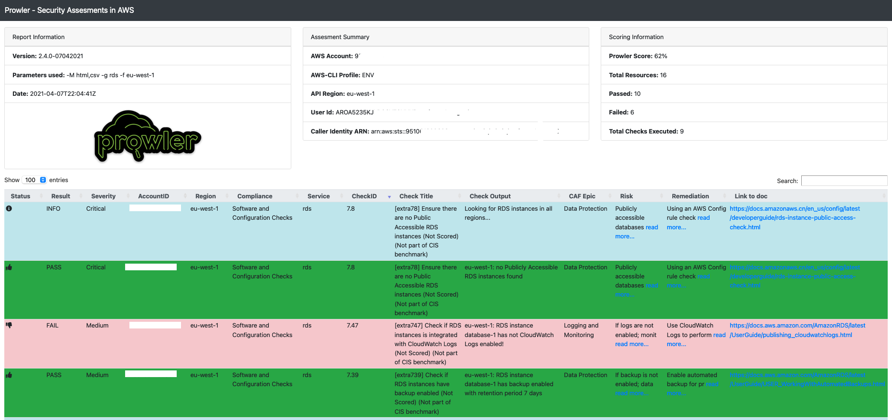
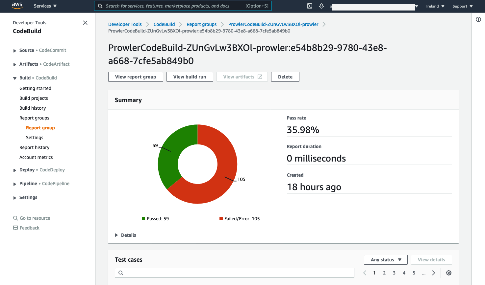

[](https://badge.fury.io/js/cdk-prowler)
[](https://badge.fury.io/py/cdk-prowler)
[](https://www.nuget.org/packages/com.github.mmuller88.cdkProwler/)


# cdk-prowler
An AWS CDK custom construct for deploying Prowler to you AWS Account. The following description about Prowler is taken from https://github.com/toniblyx/prowler: 

Prowler is a security tool to perform AWS security best practices assessments, audits, incident response, continuous monitoring, hardening and forensics readiness. It contains all CIS controls listed here https://d0.awsstatic.com/whitepapers/compliance/AWS_CIS_Foundations_Benchmark.pdf and more than 100 additional checks that help on GDPR, HIPAA…

It generates security html results which are stored in an s3 bucket:



And in your Codebuild Report group:



# AWS AMI
If you just want to make the Prowler security checks in your account try my [Prowler AWS Marketplace AMI](https://aws.amazon.com/marketplace/server/procurement?productId=afcd0906-5270-4e49-82d8-5e8648250bcb). With just $1 Prowler will do over 180 security checks across a huge amount of AWS services in all your regions. Don't forget the terminate the Ec2 instance when the Prowler stack got created for not paying more than that $1 :).

With buying the AMI you support my on my passion for creating open source products like this cdk-prowler construct. Furthermore you enable me to work on future features like mentioned in the **Planned Features** section. Thank you so much :) !

# Example
```ts
import { ProwlerAudit } from 'cdk-prowler';
...
    const app = new App();

    const stack = new Stack(app, 'ProwlerAudit-stack');

    new ProwlerAudit(stack, 'ProwlerAudit');
```

# cdk-prowler Properties
cdk-prowler supports some properties to tweak your stack. Like for running a Cloudwatch schedule to regualary run the Prowler scan with a defined cron expression.

You can see the supported properties in [Api.md](Api.md)

# Planned Features
* Supporting AWS SecurityHub https://github.com/toniblyx/prowler#security-hub-integration
* Triggering an event with SNS when prowler finishes the run
* AMI EC2 executable

# Architecture


# Misc

```sh
yes | yarn destroy && yarn deploy --require-approval never
```

Rerun Prowler on deploy

```sh
yarn deploy --require-approval never -c reRunProwler=true
```

# Thanks To
* My friend and fellaw ex colleague Tony de la Fuente (https://github.com/toniblyx https://twitter.com/ToniBlyx) for developing such a cool security tool as [Prowler](https://github.com/toniblyx/prowler)
* As always to the amazing CDK / Projen Community. Join us on [Slack](https://cdk-dev.slack.com)!
* [Projen](https://github.com/projen/projen) project and the community around it

    